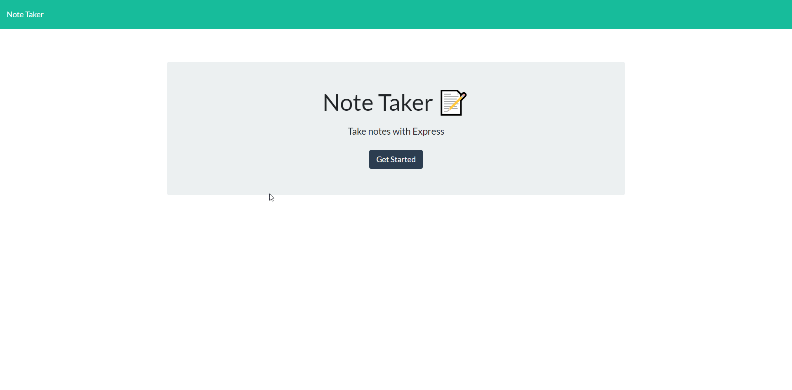

# Note-Taker

## Description
---  
Note Taker allows users to make notes. Once a note is created user can also delete their notes.

## Live Deployment
---   
Heroku:  https://intense-lake-32151.herokuapp.com/

## Screenshot
---  
   

## Bugs
--- 
There was an issue with the new note button. If you clicked on an already created note and then clicked on the new note button you were not able to add a new note without refreshing the page.  
This issue was fixed by removing the "Read Only" attribute in the else statement in the renderActiveNote function of index.js

## Author
---  
Jon Shallcross